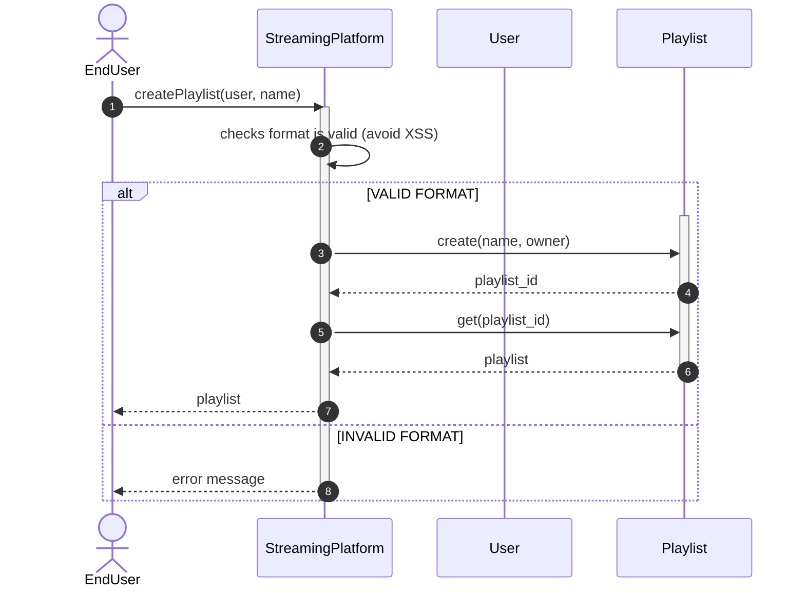
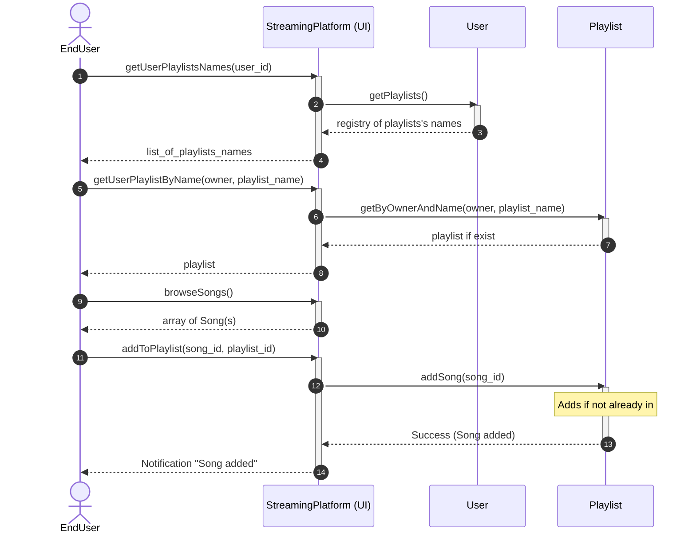
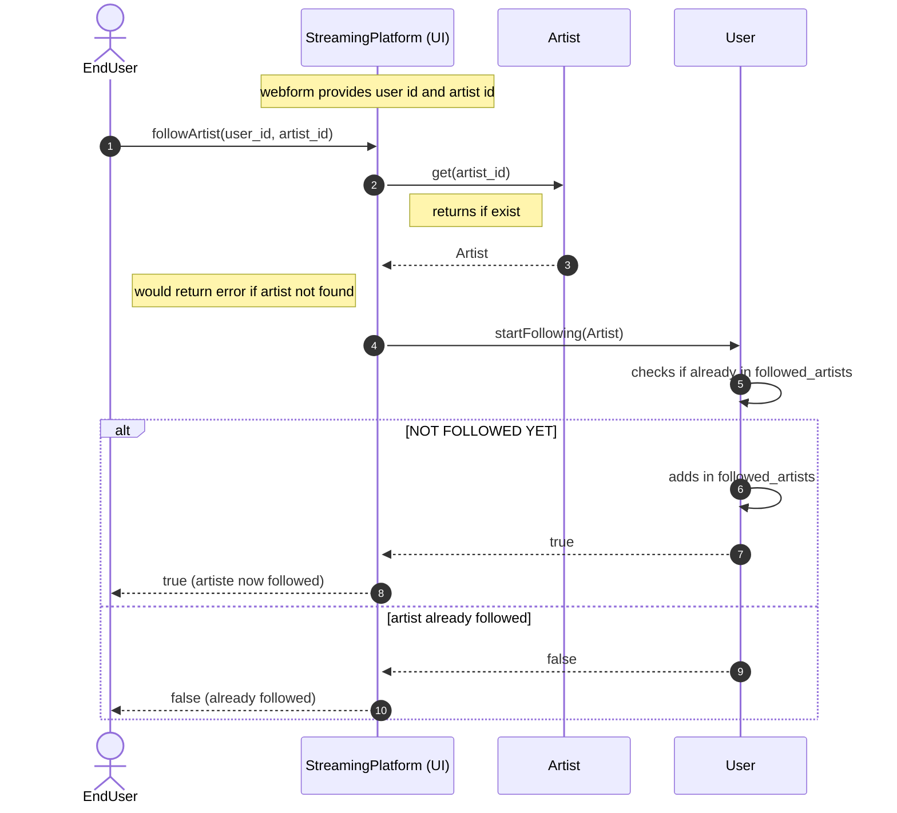

# Music Streaming Platform — diagramms

## Context

This document holds class and sequence diagrams designed as a collaborative work during a Holberton's Peer Learning Day.
Exercise's frame can be accessed here: https://intranet.hbtn.io/projects/3875 (require access to Holberton intranet)
Chosen scenario's context (Music Streaming Platorm) can be found here: https://intranet.hbtn.io/concepts/1517

Hereunder are copy/paste/embeds of the Mermaid source files available in the same folder.
They can be studied while keeping in mind the time constraints and design choice explained in the document
    [Design Defence](./StreamingPlatform__Design-defence_v1_0.md) (note: document generated by IA as was supposed to be primarily a support document for oral presentation).

---

## 1. Class Diagram

Source: [Streaming Platform Class Diagram](./StreamingPlatform__Class-diagram_minimal_v1.0.md)

```mermaid
classDiagram
    %% IMPORTANT: 
    %% 1/ "parameter names" are skipped when datatype is explicit enough 
    %%   (ex: "user: User" -> just "User")
    %% 2/ We didn't have enough time to regroup potentially common methods with Protocol
    %%    "simulated inheritance", like create.
    %% 3/ Unless said otherwise, "boolean" returns are just to indicate success/failure of method.
    %% 4/ Create static methods return int for the technical_id of new insertion.
    %% 5/ All data classes have a technical id "id", used together with the static "get" method to retrieve instances.
    %% 6/ In case modules are available, for every attribute representing a link to a filesystem path
    %%    (Song.source_path, User.avatar, Album.thumbnail) favor pathlib.Path over simple str.

    %% Database handler, receives "commands" from the webform through API requests.
    %% Assumption is made that when listings/forms are created in UI they have all the information.
    %% So can directly provide for example the technical id of a Song or Playlist.
    class StreamingPlatform {
        %% We use User as we get all playlist_ids at once from attribute "playlists"
        %%   but maybe going for user_id and filtering Playlists by owner was better?
        +getUserPlaylistsNames(user: User) id: list[str]
        %% We need user_id in case different endusers have created playlist with same name
        +getUserPlaylistByName(owner: user_id, playlist_name: str) Playlist

        %% Playlist creation: controls data format then delegates to Playlist::create
        +createPlaylist(user: User, name: str) Playlist

        %% Music manipulation interfaces
        +browseSongs(filters: list[str]) set[Song]
        +browseAlbums(filters: list[str]) set[Album]
        +addToPlaylist(song: Song, playlist: Playlist) bool
        %% Assumption that webform which displays songs can directly provide technical id
        +removeFromPlaylist(song_id: int, playlist_id: int) bool

        %% Artist following feature controls
        +followArtist(user_id: int, artist_id: int) bool
        +unfollowArtist(user_id: int, artist_id: int) bool

        %% ------- COMMENTED because not directly linked to exercise -------
        %% User profile interactions
        %% +userLogin(username: str, password: str) User
        %% Idea: receives strings from webform, controls then delegate to User methods.
        %% +updateUserProfile(user_form_data: list[str]) None
        %% Same logic as playlist creation
        %% +registerUser(username: str, email: str, password: str) User
        %% ------- END COMMENT BLOCK -------
    }

    class Song {
        -id: int
        -title: str
        -artist: Artist
        -time: float
        -style: str
        -source_path: str
        -album: Album
        %% All other parameters are optional, don't know how to "say" that in Mermaid
        +create(title: str, Artist)$ int
        +get(id: int)$ Song

        %% Instance methods
        +delete() bool
        %% Required to actually have a workable interface on the front-end ;)
        +getInfos() list[str]
    }

    class Album {
        -id: int
        -label: str
        -title: str
        -thumnail: str
        -nb_songs: int
        -songs: set[Song]

        %% Static public class method
        +create(title: str, label: str)$ int
        +get(id)$ Album

        %% Instance methods
        %% In theory since we view relation with Song as composition should delete related Songs
        %% In practice system would go for something more flexible so closer to aggregation.
        +delete()$ bool

        %% Public facing to add from 0 to n, returns number of insertions
        +addSongs(list[Song]) int
        %% Delegated to this private for data control before inserting
        -addSong(Song): bool
        %% Same logic but inverted
        +removeSongs(list[Song])
        -removeSong(Song)
        %% Grab the list
        +getSongs() set[Song]
    }

    class Artist {
        -id: int
        -name: str
        -members: set[str]
        %% Probably "computed values", not data actually stored "as part of Artist info"
        -songs: set[Song]
        -albums: set[Album]

        %% Public static method
        +create(name: str)$ int
        +get(id)$ Artist

        %% Public instance method
        +delete() bool
        %% Note: would trigger chained deletion of related Song and Album.
        %% Would also consequently require "cleaning" of all Playlists,
        %%   or rather some simple mechanism of "default Song" / "info message" for user.
        %% Or maybe an "autoclean" feature on Playlist when loaded from db?

        %% get "computed data"
        +getSongs() set[Song]
        +getAlbums() set[Album]
    }

    %% Note: no subdivision "Client / Admin" because not enough time to get into 
    %%   platform "administration"
    class User {
        -id: int
        -username: str
        -email: str
        -password: str
        -followed_artists: set[Artist]
        -playlists: set[Playlist]

        %% Public static method
        +create(username: str, email: str, password: str)$ int
        +get(id)$ User

        %% Public instance method
        +delete() bool

        +getPlaylists() List[int]
        +getPlaylist(playlist_id: int) Playlist
        +startFollowing(Artist) bool
        +stopFollowing(Artist) bool
        +getFollowedArtists() set[Artist]

        %% ------- COMMENTED because not directly linked to exercise -------
        %% -avatar: str
        %% Just this as the bare minimum to control permission access as "client"
        %% -roles: list[str]
        %% -subscription_type: str
        %% +updateAvatar(image) None
        %% +setEmail(str) None
        %% ------- END COMMENT BLOCK -------
    }



    class Playlist {
        -id: int
        -name: str
        -owner: User
        %% Albums are just a collection of Songs and can be "reconstructed"
        %%   from songs metadata if necessary. So we only store Songs in Playlist.
        -songs: set[Song]
        %% Public static method
        +create(name: str, owner: User)$ int
        +get(id: int)$ Playlist
        +getByOwnerAndName(name: str, owner: int)$

        %% Public instance methods
        %% Would also trigger an update of owner.playlists if it is not computed at runtime.
        +delete() bool

        %% Content management
        +addSong(Song) bool
        +addAlbum(Album) bool
        +removeSong(Song) bool
        +removeAlbum(Album) bool
        +getTracks() set[Song]
    }

    %% Simplified conception, we know in real life app they could exist independantly.
    %% Artist *-- Song *-- Album vs Artist *-- Album *-- Song
    %% Heavy debate, in the end the latter won.
    %% 0 to x because technically you could create album but wait before adding songs.
    Artist "1" *-- "0..*" Album : designs
    Album "1" *-- "0..*" Song : contains
    Song "1" --> "1" Artist : composed and interpreted by
    %% Song *-- Playlist not good because technically Song can exist without Playlist.
    %% So it is an aggregation, especially since you could also technically have empty Playlist.
    Playlist "1" o-- "0..*" Song : references
    %% Simplified conception, in real life possibly playlists could be shared
    %%   meaning a n to n and possibly aggregation rather than composition.
    User "1" *-- "0..*" Playlist : has exclusive
    User "0..*" o-- "0..*" Artist: follows

    %% StreamingPlatform has dependencies on all classes since being the orchestrator
    %%   which checks and delegate end-user requests.
    %% Unless we even consider it is THE central class and that no data is pertinent without
    %%   in which case all relationships are not dependencies but composition.
    StreamingPlatform "1" --> "0..*" Album    : uses
    StreamingPlatform "1" --> "0..*" Song     : uses
    StreamingPlatform "1" --> "0..*" User     : uses
    StreamingPlatform "1" --> "0..*" Playlist : uses

```

## 2a. Sequence diagram - Creating playlist

Source: [Streaming Platform Class Diagram](./StreamingPlatform__Sequence_Creating-playlist_v1.0.md)

## 2b. Sequence diagram - Adding a song to existing playlist

Source: [Streaming Platform Class Diagram](./StreamingPlatform__Sequence_Adding-song-to-playlist_v1.0.md)

## 2c. Sequence diagram - Deciding to follow an artist for future publications

Source: [Streaming Platform Class Diagram](./StreamingPlatform__Sequence_Following-artist_v1.0.md)

