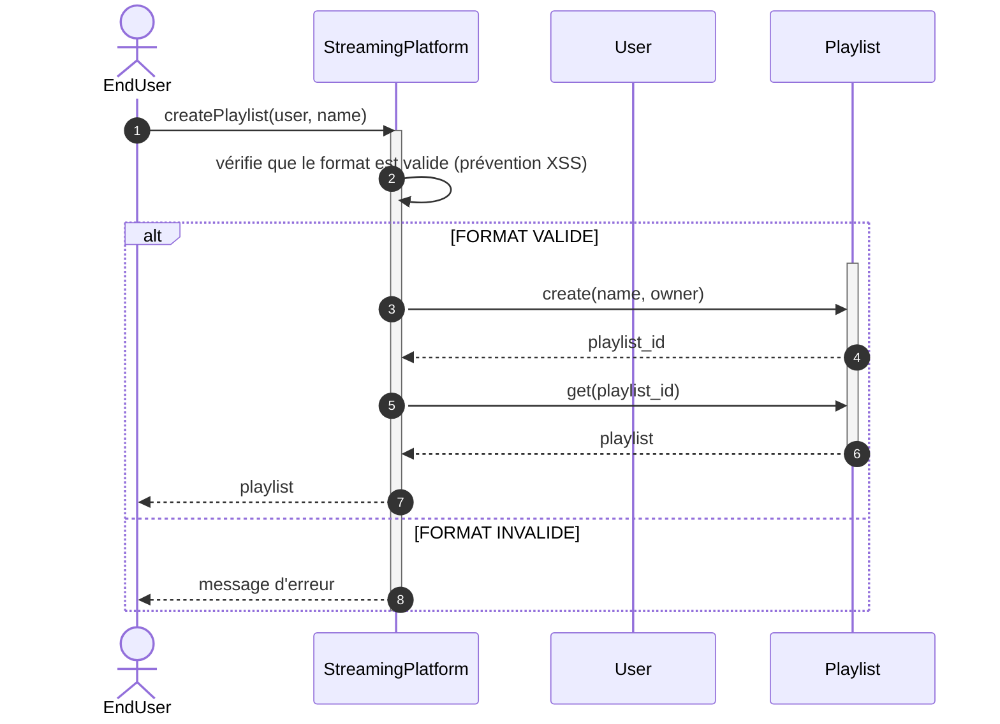
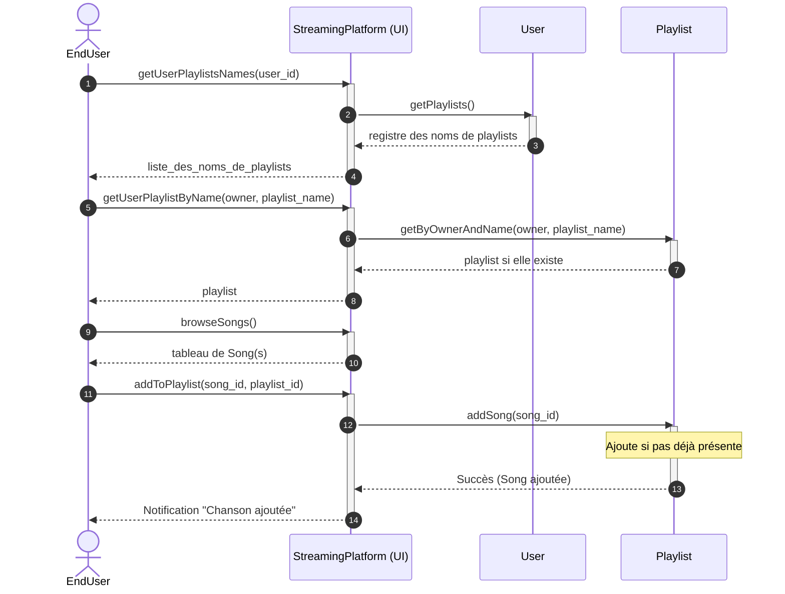
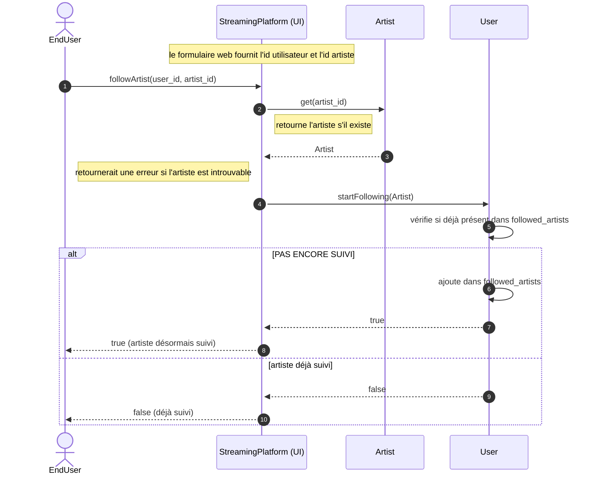

# Music Streaming Platform — diagrammes

## Contexte

Ce document présente les diagrammes réalisés durant un exercice de conception d'application présenté dans le cadre de la formation Holberton.
Les consignes de l'exercice peuvent être lues ici (accès à l'intranet de l'école requis) : https://intranet.hbtn.io/projects/3875.
Le contexte du scénario choisi "Plateforme de streaming musical" peut être lu ici (même remarque):  https://intranet.hbtn.io/concepts/1517

Ci-dessous sont présentés de manière intégrés les diagrammes UML fournis par les fichiers .mmd présents dans le même répertoire.
Ils pourront être consultés en prenant en compte les contraintes de temps et les choix de conception effectués par l'équipe, présentés dans le document associé 
    [Défense du design](./StreamingPlatform__Design-defense_v1_0_FR.md) (note: ce document a été généré par IA car conçu initialement comme support de révision/présentation pour la présentation orale qui a été annulée).

NOTE : toutes les versions françaises sont des traductions générées par IA, le contenu 100% original étant uniquement la version anglaise.
---

## 1. Diagramme de classes

Source: [Streaming Platform Class Diagram](./StreamingPlatform__Class-diagram_minimal_v1.0_FR.md)

```mermaid
classDiagram
    %% IMPORTANT : 
    %% 1/ Les noms de paramètres sont omis quand le type est suffisamment explicite
    %%    (ex: "user: User" -> juste "User")
    %% 2/ Faute de temps, nous n'avons pas pu regrouper les méthodes communes via un Protocol
    %%    (héritage simulé), comme create.
    %% 3/ Sauf mention contraire, les retours "boolean" indiquent le succès ou l'échec de la méthode.
    %% 4/ Les méthodes statiques create retournent un int correspondant au technical_id de la nouvelle insertion.
    %% 5/ Toutes les classes de données ont un identifiant technique "id",
    %%    utilisé conjointement avec la méthode statique "get" pour récupérer les instances.
    %% 6/ Si les modules sont disponibles, pour tout attribut représentant un chemin vers le système de fichiers
    %%    (Song.source_path, User.avatar, Album.thumbnail) préférer pathlib.Path à un simple str.

    %% Gestionnaire de base de données, reçoit les "commandes" du formulaire web via des requêtes API.
    %% Hypothèse : lors de la création des listings/formulaires côté UI, toutes les informations sont disponibles.
    %% On peut donc fournir directement l'identifiant technique d'une Song ou d'une Playlist.
    class StreamingPlatform {
        %% On utilise User car on récupère d'un coup tous les playlist_ids via l'attribut "playlists"
        %%   mais filtrer les Playlist par owner à partir d'un user_id aurait peut-être été préférable ?
        +getUserPlaylistsNames(user: User) id: list[str]
        %% On a besoin du user_id car deux utilisateurs peuvent avoir créé une playlist avec le même nom
        +getUserPlaylistByName(owner: user_id, playlist_name: str) Playlist

        %% Création de playlist : contrôle le format des données puis délègue à Playlist::create
        +createPlaylist(user: User, name: str) Playlist

        %% Interfaces de manipulation musicale
        +browseSongs(filters: list[str]) set[Song]
        +browseAlbums(filters: list[str]) set[Album]
        +addToPlaylist(song: Song, playlist: Playlist) bool
        %% Hypothèse : le formulaire web qui affiche les chansons peut fournir directement le technical_id
        +removeFromPlaylist(song_id: int, playlist_id: int) bool

        %% Gestion du suivi d'artistes
        +followArtist(user_id: int, artist_id: int) bool
        +unfollowArtist(user_id: int, artist_id: int) bool

        %% ------- COMMENTÉ car non directement lié à l'exercice -------
        %% Interactions avec le profil utilisateur
        %% +userLogin(username: str, password: str) User
        %% Idée : reçoit des chaînes depuis le formulaire web, les contrôle puis délègue aux méthodes de User.
        %% +updateUserProfile(user_form_data: list[str]) None
        %% Même logique que la création de playlist
        %% +registerUser(username: str, email: str, password: str) User
        %% ------- FIN BLOC COMMENTAIRE -------
    }

    class Song {
        -id: int
        -title: str
        -artist: Artist
        -time: float
        -style: str
        -source_path: str
        -album: Album
        %% Tous les autres paramètres sont optionnels, sans syntaxe Mermaid dédiée pour l'exprimer
        +create(title: str, Artist)$ int
        +get(id: int)$ Song

        %% Méthodes d'instance
        +delete() bool
        %% Nécessaire pour avoir une interface utilisable côté front-end ;)
        +getInfos() list[str]
    }

    class Album {
        -id: int
        -label: str
        -title: str
        -thumnail: str
        -nb_songs: int
        -songs: set[Song]

        %% Méthode publique statique de classe
        +create(title: str, label: str)$ int
        +get(id)$ Album

        %% Méthodes d'instance
        %% En théorie, la composition avec Song devrait entraîner la suppression des Song liées.
        %% En pratique, le système serait plus souple, ce qui se rapproche davantage d'une agrégation.
        +delete()$ bool

        %% Interface publique pour ajouter de 0 à n chansons, retourne le nombre d'insertions
        +addSongs(list[Song]) int
        %% Délégué à cette méthode privée pour contrôle des données avant insertion
        -addSong(Song): bool
        %% Même logique mais dans le sens inverse
        +removeSongs(list[Song])
        -removeSong(Song)
        %% Récupère la liste
        +getSongs() set[Song]
    }

    class Artist {
        -id: int
        -name: str
        -members: set[str]
        %% Probablement des "valeurs calculées", pas des données stockées directement dans Artist
        -songs: set[Song]
        -albums: set[Album]

        %% Méthode publique statique
        +create(name: str)$ int
        +get(id)$ Artist

        %% Méthode publique d'instance
        +delete() bool
        %% Note : déclencherait la suppression en cascade des Song et Album liés.
        %%   Nécessiterait aussi un "nettoyage" de toutes les Playlist concernées,
        %%   ou un mécanisme simple de "Song par défaut" / "message d'information" pour l'utilisateur.
        %%   Ou peut-être une fonctionnalité d'"autonettoyage" de Playlist au chargement depuis la bdd ?
        
        %% Récuperer les "données calculées"
        +getSongs() set[Song]
        +getAlbums() set[Album]
    }

    %% Note : pas de subdivision "Client / Admin" faute de temps pour modéliser
    %%   l'administration de la plateforme
    class User {
        -id: int
        -username: str
        -email: str
        -password: str
        -followed_artists: set[Artist]
        -playlists: set[Playlist]

        %% Méthode publique statique
        +create(username: str, email: str, password: str)$ int
        +get(id)$ User

        %% Méthode publique d'instance
        +delete() bool
        +getPlaylists() List[int]
        +getPlaylist(playlist_id: int) Playlist
        +startFollowing(Artist) bool
        +stopFollowing(Artist) bool
        +getFollowedArtists() set[Artist]

        %% ------- COMMENTÉ car non directement lié à l'exercice -------
        %% -avatar: str
        %% Minimum syndical pour contrôler les droits d'accès en tant que "client"
        %% -roles: list[str]
        %% -subscription_type: str
        %% +updateAvatar(image) None
        %% +setEmail(str) None
        %% ------- FIN BLOC COMMENTAIRE -------
    }



    class Playlist {
        -id: int
        -name: str
        -owner: User
        %% Les albums sont juste un ensemble de Song et peuvent être "reconstruits"
        %%   à partir des métadonnées des chansons si nécessaire.
        %%   On ne stocke donc que des Song dans la Playlist.
        -songs: set[Song]
        %% Méthode publique statique
        +create(name: str, owner: User)$ int
        +get(id: int)$ Playlist
        +getByOwnerAndName(name: str, owner: int)$

        %% Méthodes publiques d'instance
        %% Déclencherait aussi une mise à jour de owner.playlists si non calculé à la volée.
        +delete() bool

        %% Gestion du contenu
        +addSong(Song) bool
        +addAlbum(Album) bool
        +removeSong(Song) bool
        +removeAlbum(Album) bool
        +getTracks() set[Song]
    }

    %% Conception simplifiée, on sait qu'en application réelle ils pourraient exister indépendamment.
    %% Débat : Artist *-- Song *-- Album vs Artist *-- Album *-- Song
    %% Après discussion, la seconde l'a emporté.
    %% 0 à x car on pourrait créer un album et attendre avant d'y ajouter des chansons.
    Artist "1" *-- "0..*" Album : designs
    Album "1" *-- "0..*" Song : contains
    Song "1" --> "1" Artist : composed and interpreted by
    %% Song *-- Playlist incorrect car une Song peut exister sans Playlist.
    %% C'est donc une agrégation, d'autant qu'une Playlist peut aussi être vide.
    Playlist "1" o-- "0..*" Song : references
    %% Conception simplifiée ; en application réelle les playlists pourraient être partagées,
    %%   impliquant un n à n et possiblement une agrégation plutôt qu'une composition.
    User "1" *-- "0..*" Playlist : has exclusive
    User "0..*" o-- "0..*" Artist: follows

    %% StreamingPlatform dépend de toutes les classes car c'est l'orchestrateur
    %%   qui vérifie et délègue les requêtes des utilisateurs finaux.
    %%   À moins de considérer que c'est LA classe centrale et qu'aucune donnée
    %%   n'a de sens sans elle, auquel cas toutes les relations seraient des compositions.
    StreamingPlatform "1" --> "0..*" Album    : uses
    StreamingPlatform "1" --> "0..*" Song     : uses
    StreamingPlatform "1" --> "0..*" User     : uses
    StreamingPlatform "1" --> "0..*" Playlist : uses

```

## 2a. Diagramme de séquence - Créer une nouvelle Playlist

Source: [Streaming Platform Class Diagram](./StreamingPlatform__Sequence_Creating-playlist_v1.0_FR.md)

## 2b. Diagramme de séquence - Ajouter une chanson (Song) à une Playlist

Source: [Streaming Platform Class Diagram](./StreamingPlatform__Sequence_Adding-song-to-playlist_v1.0.md)

## 2c. Diagramme de séquence - Suivre un Artist(e)

Source: [Streaming Platform Class Diagram](./StreamingPlatform__Sequence_Following-artist_v1.0.md)

